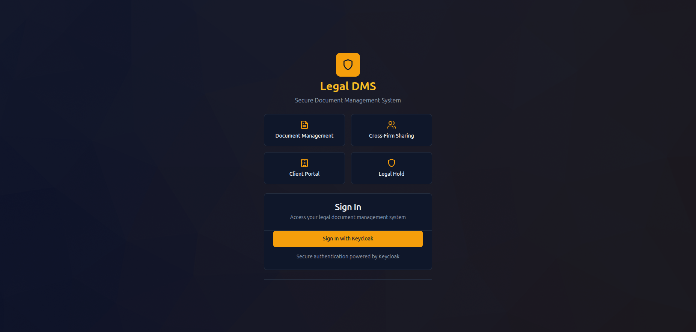
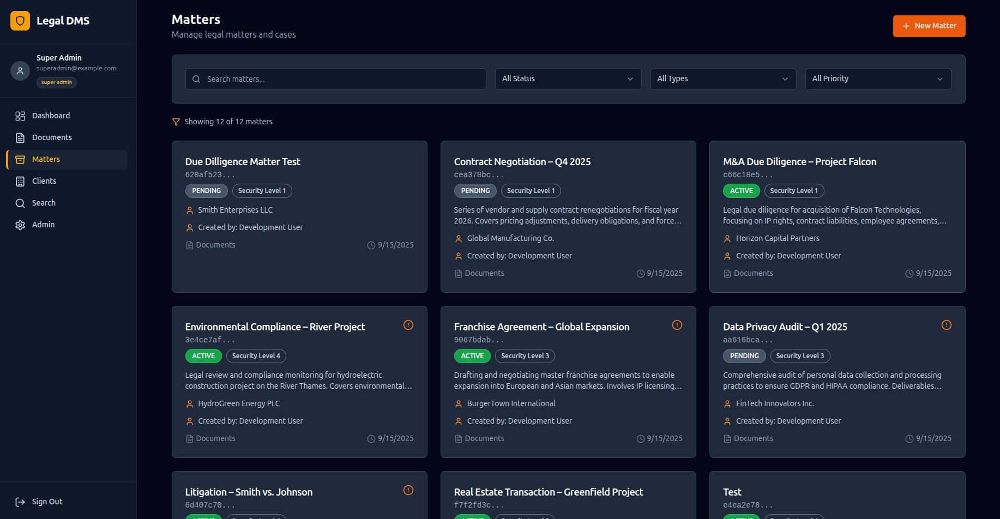
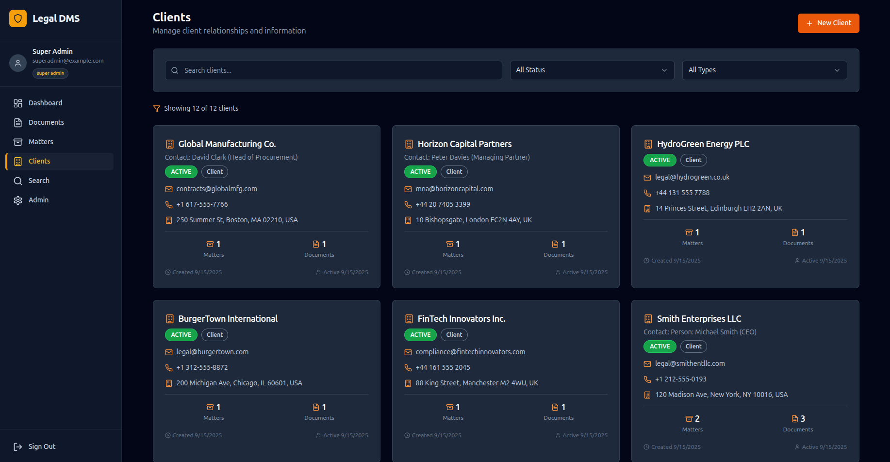
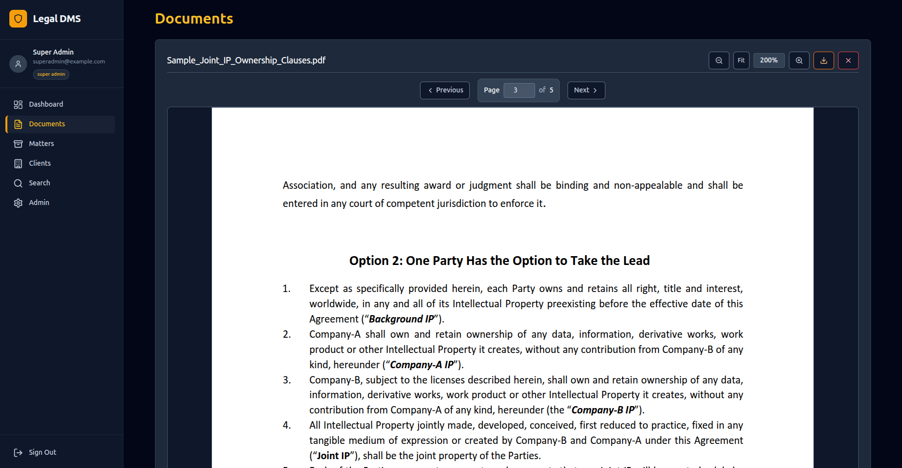
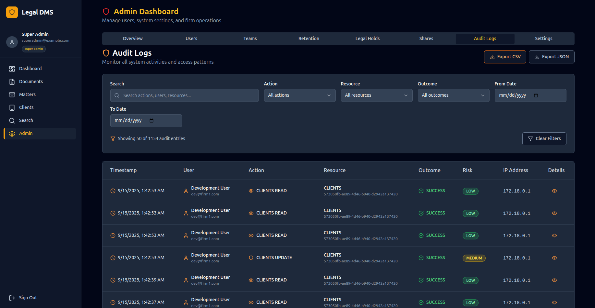
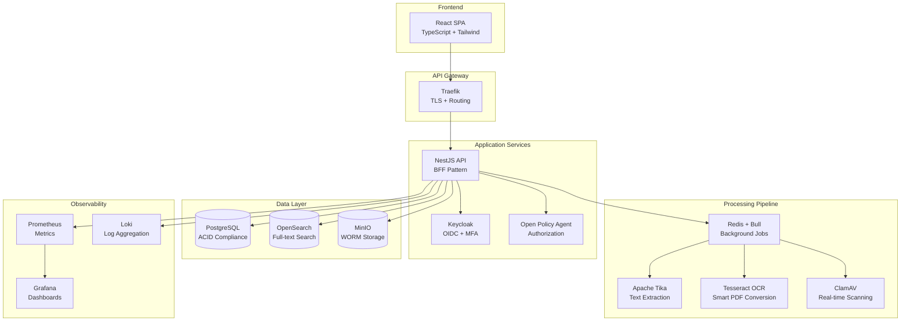

# 🏛️ Private Legal Document Management System

> **Enterprise-grade, self-hosted legal DMS with WORM compliance, matter-centric workflows, and zero-trust security architecture**

A comprehensive legal document management system built for law firms requiring on-premise security, regulatory compliance, and sophisticated access controls. Features military-grade security, full audit trails, client portal access, and cross-firm collaboration capabilities.



---

## 🌟 Key Features

### 🔐 **Security & Compliance First**
- **WORM-Capable Storage** — Immutable document retention with MinIO Object Lock
- **Zero-Trust Architecture** — mTLS between services, OPA-based authorization
- **ISO 27001/9001 Ready** — Complete audit trails, evidence collection, quarterly security scans
- **Multi-Factor Authentication** — Keycloak OIDC with WebAuthn/TOTP support
- **End-to-End Encryption** — TLS termination, encrypted storage, secure sessions

### 📁 **Advanced Document Management**
- **Intelligent Processing** — Apache Tika extraction + Tesseract OCR with smart PDF conversion
- **Background Processing** — Non-blocking document pipeline with virus scanning, text extraction, and OCR
- **Smart OCR Conversion** — Automatic conversion of text-rich images to searchable PDFs
- **Enhanced Image Viewer** — Professional image viewer with zoom, pan, rotate, and full-screen controls
- **Version Control** — Complete document history with SHA-256 integrity
- **Smart Search** — OpenSearch with OCR text indexing and faceted filtering
- **Legal Holds** — Automated deletion prevention with compliance reporting
- **Watermarked Previews** — Role-based document access with enhanced PDF.js viewer

### 👥 **Collaboration & Access Control**
- **Role-Based Access Control** — 7-tier permission system with attribute-based policies
- **Client Portal** — Secure client access to assigned matters and documents
- **Cross-Firm Sharing** — Time-boxed collaboration with external partners
- **Matter-Centric Workflows** — Organized by cases with team assignments

### 📊 **Enterprise Observability**
- **Complete Audit Trails** — Every action logged with forensic detail
- **Real-Time Monitoring** — Prometheus + Grafana dashboards
- **Automated Security Scanning** — OWASP ZAP, Trivy, dependency audits
- **Backup & Recovery** — Automated snapshots with restore procedures

---

## 🖼️ Application Screenshots

### Legal Matter Management

*Comprehensive matter management with status tracking, security classifications, and team assignments*

### Client Relationship Management  

*Client portal integration with matter associations and communication tracking*

### Advanced Document Viewer

*Professional document viewer with enhanced image controls (zoom, pan, rotate), PDF navigation, and role-based watermarking*

### Security & Audit Logs

*Comprehensive audit trail with advanced filtering, export capabilities, and compliance reporting*

---

## 🏗️ Architecture & Technology Stack

### **Frontend** — Modern React Application
```typescript
- React 18 + TypeScript — Component-based UI architecture
- Vite — Lightning-fast development and builds  
- Tailwind CSS + shadcn/ui — Professional design system
- TanStack Query — Intelligent server state management
- React Hook Form + Zod — Type-safe form validation
- PDF.js — Client-side document rendering
```

### **Backend** — Scalable Node.js API
```typescript
- NestJS — Enterprise application framework
- TypeORM — Type-safe database operations
- PostgreSQL — ACID-compliant primary database
- Keycloak — Identity & access management
- Open Policy Agent — Centralized authorization engine
- MinIO — S3-compatible object storage with WORM
```

### **Processing Pipeline** — Document Intelligence
```bash
- Apache Tika — Multi-format text extraction
- Tesseract OCR — Smart OCR with automatic PDF conversion
- ClamAV — Real-time virus scanning with TCP protocol
- OpenSearch — Advanced full-text search with OCR text indexing
- Redis + Bull — Background job processing with retry logic
- MinIO Integration — WORM-compliant object storage pipeline
```

### **Security & Monitoring** — Defense in Depth
```yaml
- Traefik — TLS termination and routing
- Vault — Secrets management and KMS
- Prometheus — Metrics collection and alerting  
- Grafana — Observability dashboards
- Loki — Centralized log aggregation
- OWASP ZAP — Automated security testing
```

---

## 🛡️ Security & Compliance

### **Regulatory Compliance**
- **ISO 27001** — Information security management
- **ISO 9001** — Quality management systems  
- **GDPR/CCPA** — Data privacy and protection
- **Legal Hold Compliance** — Automated litigation hold management
- **Retention Policies** — Configurable document lifecycle management

### **Security Testing & Auditing**
```bash
# Automated Security Pipeline
├── OWASP ZAP Baseline Scans
├── Trivy Container Vulnerability Scanning  
├── NPM/PIP Dependency Auditing
├── OPA Policy Unit Testing
└── Penetration Testing Playbooks
```

### **Evidence Collection**
- **Continuous Security Monitoring** — Automated evidence collection for audits
- **Quarterly Penetration Testing** — Documented security assessments
- **Audit Trail Exports** — Complete activity logs in multiple formats
- **Compliance Reporting** — Ready-made reports for regulatory requirements

---

## 🚀 Quick Start

### **Prerequisites**
- Docker & Docker Compose
- 8GB+ RAM recommended
- 50GB+ storage for document processing

### **One-Command Deployment**
```bash
# Clone and start the entire stack
git clone <repository>
cd private-legal-dms
make up

# Access the application
open http://localhost
```

### **Default Access**
- **Application**: http://localhost
- **Admin Portal**: admin/admin via Keycloak
- **MinIO Console**: http://localhost:9001
- **Monitoring**: http://localhost:3001 (Grafana)

---

## 🏢 Enterprise Architecture



---

## 🔧 Development Environment

### **Project Structure**
```
├── services/
│   ├── app/          # NestJS Backend API
│   ├── frontend/     # React TypeScript SPA  
│   └── worker/       # Background Processing
├── infra/
│   ├── keycloak/     # Identity Configuration
│   ├── opa/          # Authorization Policies
│   ├── prometheus/   # Monitoring Setup
│   └── grafana/      # Dashboard Configs
├── docs/
│   ├── security/     # Security Documentation
│   └── api/          # API Documentation
└── scripts/          # Automation & Utilities
```

### **Development Commands**
```bash
# Start all services
make up

# View application logs  
make logs

# Run database migrations
make migrate

# Seed development data
make seed

# Stop all services
make down

# Run security scans
make security-scan
```

### **Service URLs (Development)**
| Service | URL | Purpose |
|---------|-----|---------|
| **Frontend** | http://localhost | Main application interface |
| **API** | http://localhost/api | Backend REST API |
| **Keycloak** | http://localhost:8081 | Authentication management |
| **MinIO Console** | http://localhost:9001 | Storage administration |
| **OpenSearch** | http://localhost:9200 | Search engine interface |
| **Grafana** | http://localhost:3001 | Monitoring dashboards |
| **Prometheus** | http://localhost:9090 | Metrics collection |

---

## 🎯 Role-Based Access Control

### **User Hierarchy**
| Role | Description | Access Level |
|------|-------------|--------------|
| **Super Admin** | System administrator | Complete system access |
| **Firm Admin** | Firm-level management | User, team, and firm settings |
| **Legal Manager** | Team supervision | Matter and team oversight |
| **Legal Professional** | Attorney/lawyer | Matter and document management |
| **Client User** | External client access | Assigned matters only |
| **External Partner** | Cross-firm collaboration | Time-limited matter access |
| **Support Staff** | Administrative support | Limited document operations |

### **Permission Matrix**
| Feature | Super Admin | Firm Admin | Legal Professional | Client User |
|---------|-------------|------------|-------------------|-------------|
| **Dashboard** | ✅ | ✅ | ✅ | ✅ |
| **Matter Management** | ✅ | ✅ | ✅ | ❌ |
| **Client Management** | ✅ | ✅ | ✅ | ❌ |
| **Document Management** | ✅ | ✅ | ✅ | ✅ (Limited) |
| **Advanced Search** | ✅ | ✅ | ✅ | ❌ |
| **Admin Panel** | ✅ | ✅ | ❌ | ❌ |
| **Client Portal** | ❌ | ❌ | ❌ | ✅ |
| **Cross-Firm Sharing** | ✅ | ✅ | ✅ | ❌ |

---

## 🔒 Security Implementation

### **Authentication & Authorization**
```typescript
// Multi-layered security approach
const securityStack = {
  authentication: "Keycloak OIDC + MFA",
  authorization: "Open Policy Agent (Rego)",
  sessionManagement: "HTTP-only cookies (BFF pattern)",
  transport: "TLS 1.3 + mTLS between services",
  storage: "AES-256 encryption at rest"
};
```

### **Automated Security Testing**
```yaml
# .github/workflows/security-scan.yml
name: Security Audit Pipeline
triggers: [pull_request, push, schedule]
scans:
  - OWASP ZAP Baseline
  - Trivy Container Scanning  
  - Dependency Vulnerability Auditing
  - OPA Policy Unit Tests
artifacts: 
  - Security reports (HTML/JSON)
  - Evidence collection for audits
```

### **Compliance & Auditing**
- **Immutable Audit Logs** — PostgreSQL append-only tables
- **Legal Hold Management** — Automated deletion prevention
- **Document Integrity** — SHA-256 checksums with verification
- **Access Monitoring** — Real-time permission tracking
- **Retention Policies** — Configurable lifecycle management

---

## 📊 Monitoring & Observability

### **Real-Time Dashboards**
- **System Health** — Service uptime, resource utilization
- **Security Metrics** — Failed logins, permission denials, virus scan results
- **Document Processing** — Upload throughput, OCR queue status, PDF conversion metrics
- **Search Analytics** — OCR text indexing performance, search query patterns
- **User Activity** — Access patterns, feature usage, document viewer analytics

### **Alerting & Notifications**
- **Security Incidents** — Automated threat detection
- **System Performance** — Resource threshold monitoring  
- **Compliance Events** — Legal hold triggers, retention alerts
- **Operational Issues** — Service failures, backup status

---

## 🏆 Why This Solution?

### **For Law Firms**
- **Complete Security** — Military-grade protection with real-time virus scanning
- **Intelligent Document Processing** — Smart OCR with automatic PDF conversion for scanned documents
- **Regulatory Compliance** — Built-in audit trails and retention management
- **Cost Effective** — Self-hosted with no per-user licensing fees
- **Professional UI** — Modern interface with enhanced document viewer and legal workflows

### **For Developers**  
- **Modern Tech Stack** — TypeScript, React, NestJS, PostgreSQL
- **Microservices Architecture** — Scalable, maintainable service design
- **Security Best Practices** — Zero-trust, defense-in-depth implementation
- **Enterprise Patterns** — BFF, CQRS, Event Sourcing where appropriate

### **For DevOps/Infrastructure**
- **Container-First** — Docker Compose to Kubernetes ready
- **Observability Built-In** — Prometheus, Grafana, Loki integration
- **Automated Testing** — Security scans, compliance checks
- **Backup & Recovery** — Documented procedures with restore drills

---

## 📚 Documentation

- **[Product Requirements Document](./PRD.md)** — Complete system specification
- **[RBAC Specification](./RBAC_SPECIFICATION.md)** — Detailed access control matrix
- **[Security CI/CD Guide](./docs/Security%20CI/SECURITY-CI-GUIDE.md)** — Automated security testing
- **[Security Testing Procedures](./docs/Security%20CI/SECURITY-TESTING.md)** — Manual security validation
- **[API Documentation](./docs/api/)** — Complete endpoint reference

---

## 📄 License

**Private/Proprietary** — Enterprise legal document management system

---

*Built with security, compliance, and scalability at its core. Perfect for law firms requiring enterprise-grade document management with complete control over their data and infrastructure.*